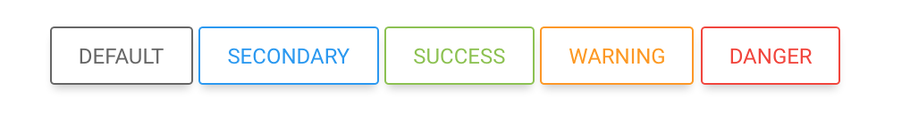

The Buttons Project
===============================

http://skrajewski.github.io/the-buttons

This repository contains **The Button Project**. In short, it's my simple experiment with HTML Buttons, the SASS technology, and a little different approach to writing CSS components.

I tried to refresh native browser buttons by creating a highly modularize and customizable equivalents. They have much more variants, modifications, and features.

What is my purpose?
- easy provides new types of buttons
- appearance modification by CSS classes
- pretty `hover`, `focus`, `active`, `disabled` states
- facilities for people with color blindness

## Thanks to
- [hail2u](https://github.com/hail2u) for [color blindness emulation](https://github.com/hail2u/color-blindness-emulation)
- [Ana Tudor](https://css-tricks.com/author/thebabydino/) for an article [Why Do We Have `repeating-linear-gradient` Anyway?](https://css-tricks.com/why-do-we-have-repeating-linear-gradient-anyway/)
- [Lea Verou](http://lea.verou.me/) for a [collection of CSS3 patterns](http://lea.verou.me/css3patterns/)

## License
Feel free to use it. This code is distributed under the MIT license.
